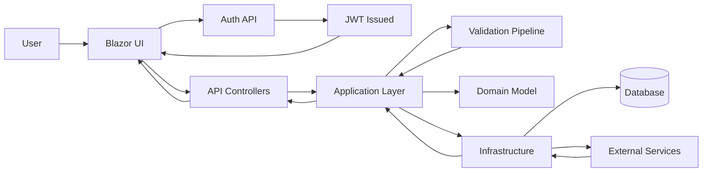
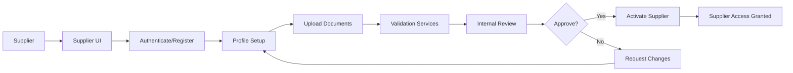

# MerinoOne Supplier Portal

MerinoOne Supplier Portal is a .NET-based supplier portal with a Clean Architecture and CQRS structure. It provides an API backend and a Blazor UI to manage supplier-related workflows.

## Key Functions

- Authentication and authorization for internal users and suppliers.
- Supplier master data and profile management.
- Messaging and communication between suppliers and the enterprise.
- Integration seams for ERP and validation services.

## Features

- Clean Architecture layering (API, Application, Domain, Infrastructure).
- CQRS with MediatR command and query separation.
- Blazor web UI for supplier and internal users.
- Policy-based authorization and JWT bearer authentication.
- Validation and error handling pipeline.
- Integration abstraction with mock implementations for development.
- Logging and diagnostics for API requests.

## Project Structure

- API host for REST endpoints.
- Application layer with commands, queries, and validation.
- Domain layer for entities and business rules.
- Infrastructure layer for persistence and integrations.
- Blazor UI for user-facing pages.
- Aspire app host for orchestration.

## Functional Flow (Entire App)

## Functional Flow (Supplier Onboarding)

## Notes

- Environment-specific configuration is kept in the standard .NET appsettings files.
- Integration services are designed for swap-in real providers later.
