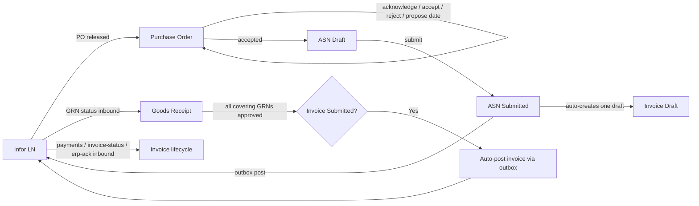
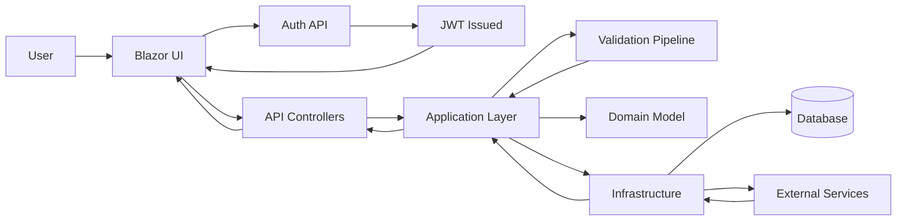
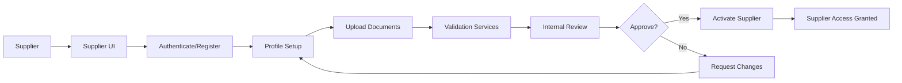
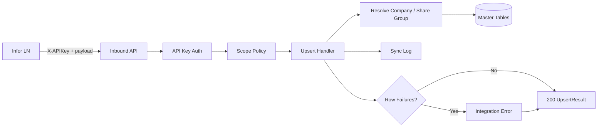

# MerinoOne Supplier Portal

MerinoOne Supplier Portal is a .NET-based supplier portal with a Clean Architecture and CQRS structure. It provides an API backend and a Blazor UI to manage supplier-related workflows.

## Key Functions

- Authentication and authorization for internal users and suppliers.
- Supplier master data and profile management, including bank-account and license records, the supplier PO-response mode, and linked portal users on the supplier detail view.
- Supplier change-request lifecycle: suppliers raise post-registration changes; internal reviewers approve / reject / bounce back, then approved deltas are applied and pushed to ERP.
- Procurement transaction lifecycle: purchase orders, advance shipment notices (ASN), goods-receipt notes (GRN), and invoices, end to end.
- Messaging and communication between suppliers and the enterprise.
- Integration seams for ERP and validation services.
- ERP/Infor integration management: endpoint configuration, endpoint-wise table sharing, an outbound transactional outbox, and sync-log observability.
- Inbound master-data and transactional ingestion from Infor LN (master data plus GRN status, payments, invoice status, and ERP acknowledgements), secured by scoped API keys.
- Reference master data administration (currencies, countries, states, cities, postal codes, units, item groups, taxes).
- Email outbox, email templates, and document upload workflows.

## Features

- Clean Architecture layering (API, Application, Domain, Infrastructure).
- CQRS with MediatR command and query separation.
- Blazor web UI for supplier and internal users.
- Policy-based authorization and JWT bearer authentication.
- Validation and error handling pipeline.
- Integration abstraction with mock implementations for development (swap mock to live via `Integration:Mode`).
- Tenant-scoped integration management with `Integration.Read` / `Integration.Manage` policies, plus `Integration.ApiKeys` for credential lifecycle.
- Inbound integration secured by a dedicated `X-APIKey` authentication scheme, per-endpoint scope policies, and request rate limiting.
- Outbound ERP posts decoupled through a transactional outbox with a post-commit dispatcher, atomic per-row claims, deterministic idempotency keys, and crash-recovery.
- Permission-backed procurement policies (`PurchaseOrder.*`, `Asn.*`, `GoodsReceipt.Read`, `Invoice.*`) and supplier change-request policies (`Supplier.ChangeRequest` / `Supplier.ApproveChange`), all seccode-scoped so a supplier sees only its own documents.
- Persistent Data Protection key ring so encrypted values and stored tokens survive deploys and app-pool recycles.
- Logging and diagnostics for API requests.

## Project Structure

- API host for REST endpoints.
- Application layer with commands, queries, and validation.
- Domain layer for entities and business rules.
- Infrastructure layer for persistence and integrations.
- Blazor UI for user-facing pages.
- Aspire app host for orchestration.

## Integration Management

Tenant-scoped admin features under `api/integration`. Reads require the `Integration.Read` policy; writes require `Integration.Manage`. All operations are scoped to the caller's tenant.

### Inbound integration (Infor LN → Portal)

External master-data ingestion is exposed under `api/integration/inbound`. These endpoints are authenticated by the non-default `ApiKey` scheme (the `X-APIKey` header — JWT stays the default scheme for everything else), authorized per-endpoint by an `Integration.Inbound.*` scope policy, and rate-limited via the named `inbound` policy (fixed window, partitioned on the key prefix with an IP fallback). An optional `Idempotency-Key` header makes replays a no-op; when absent the handler hashes the canonical payload.

Two endpoint families are supported:

- Company-scoped (body carries a `CompanyCode`, resolved and normalized to its share-group source; the key must be bound to that source company):
  - `POST api/integration/inbound/payment-terms`
  - `POST api/integration/inbound/delivery-terms`
  - `POST api/integration/inbound/units`
  - `POST api/integration/inbound/item-groups`
  - `POST api/integration/inbound/items`
- Tenant-scoped (no `CompanyCode`; bound to the key's tenant):
  - `POST api/integration/inbound/currencies`
  - `POST api/integration/inbound/countries`
  - `POST api/integration/inbound/states`
  - `POST api/integration/inbound/cities`
  - `POST api/integration/inbound/postal-codes`

Each call returns an `UpsertResultDto` with per-row outcomes; partial failures are flagged and raise an integration error for operator retry. The endpoint kill-switch (disabled endpoint) rejects pushes with 403; an invalid key returns a single generic 401; spoofed/unknown companies are rejected.

### API keys

Inbound credentials are managed under `api/admin/api-keys`. Listing requires `Integration.Read`; create / rotate / revoke require `Integration.ApiKeys`.

- `GET    api/admin/api-keys` — list the tenant's keys (metadata only; never the hash or plaintext). `activeOnly` hides revoked keys; the default includes rotation history.
- `POST   api/admin/api-keys` — mint a key bound to one or more source companies plus endpoint scopes, with an optional expiry. Format is `mok_` + base64url(32 random bytes); only the short non-secret prefix and a SHA-256 hash are stored, and the plaintext is returned exactly once.
- `POST   api/admin/api-keys/{id}/rotate` — mint a successor (same tenant/company/scopes/expiry) and revoke the predecessor, linked via `ReplacedByApiKeyId`.
- `POST   api/admin/api-keys/{id}/revoke` — revoke immediately (idempotent); subsequent inbound calls with the key return 401.

Multi-company binding is stored in an `apiKeyCompany` junction (one row per bound company); the auth handler mints one `tenantEntityId` claim per bound company and one `permission` claim per scope, so the existing permission policy provider enforces the per-endpoint scope with no bespoke handler.

### Developer docs and interactive reference

A read-only catalog of the inbound endpoints is exposed at `GET api/integration/catalog` (requires `Integration.Read`) and rendered by the in-app Developer Docs page at `/integrations/docs`. From there an operator can:

- Select the endpoints a partner needs and read each one's description, sample request body, and a ready-to-run `curl` snippet.
- Export a self-contained PDF guide for the selected endpoints (optionally embedding a freshly minted key).
- Generate an API key scoped to exactly the selected endpoints and bound to chosen source companies (requires `Integration.ApiKeys`); the plaintext is shown once in a copy-once dialog.

A second, filtered OpenAPI document (`integration`) is rendered by Scalar at `/integration-docs` as the partner-facing try-it reference (X-APIKey preferred). A Development-time startup guard asserts the docs catalog and the allowed inbound scopes stay in sync, so adding or removing a scoped endpoint without updating the catalog fails fast.

### Sync log and integration errors

Inbound/outbound synchronization is observable under `api/integration` (all reads require `Integration.Read`):

- `GET api/integration/sync-log` — paged sync history with optional `status` and `entityName` filters.
- `GET api/integration/sync-log/{id}/payload` — the stored request JSON for a single inbound row, fetched on demand (the list never ships the full payload). Tenant-filtered.
- `GET api/integration/errors` — paged integration errors (filter by resolved/unresolved).
- `POST api/integration/errors/{id}/retry` — re-queue a failed payload (`Integration.Manage`).
- `GET api/integration/endpoints` / `PUT api/integration/endpoints/{id}` / `POST api/integration/endpoints/{id}/toggle` — endpoint configuration plus inbound-session telemetry and the inbound kill-switch (`Integration.Manage` for writes).

The Blazor Sync Log page (`/integrations/sync-log`, admin-only) lists events with a status filter and an on-demand payload viewer that pretty-prints the stored request JSON.

### Infor connection configuration

Per-tenant Infor CloudSuite (ION API) connection settings are managed under `api/infor-connection` from the System Settings section (read `Settings.Read`, write `Settings.Write`). Secrets are encrypted at rest via Data Protection and masked on read; `POST api/infor-connection/test` performs a live OAuth2 token request to verify the connection without persisting anything.

### Endpoint-wise table sharing (Share Groups)

Companies in a share group read/write a single shared master dataset per endpoint (e.g. Payment Term, Delivery Term), stored under a designated source company. Companies not in a group keep their own per-company master data.

- `GET    api/integration/share-groups` — list groups (optional `endpoint` filter), members resolved to company code + name.
- `POST   api/integration/share-groups` — create a group (endpoint + source company + initial members).
- `PUT    api/integration/share-groups/{id}` — update display name + enabled flag (endpoint/source/members not editable here).
- `POST   api/integration/share-groups/{id}/members` — add a member (restores a soft-deleted membership rather than duplicating).
- `DELETE api/integration/share-groups/{id}/members/{tenantEntityId}` — soft-delete a member (idempotent).
- `DELETE api/integration/share-groups/{id}` — soft-delete a group and its members.

Rules: a company can belong to only one group per endpoint (409 on conflict); a group is unique per (endpoint, source). Changes are not retroactive — already-received master rows keep their original source company. Blazor page: `/integrations/share-groups`.

### Other integration features

- Infor endpoints management with CRUD operations.
- Email outbox and email templates management.
- Document upload workflows.

## Reference Master Data

Infor LN reference masters are administered under `api/masters` (read `Settings.Read`, write `Settings.Write`), each with list, get-by-id, create, update, and deactivate operations: Currency, Country, State, City, PostalCode, Unit, ItemGroup, and Tax. Authenticated geo typeahead lookups (`api/masters/geo/*`) back the supplier-address country → state → city → postal-code cascade.

The Tax master (`api/masters/taxes`) is a company-shared master of tax codes used on PO and invoice lines: `GET` list (optional `isActive` filter) / `GET {id}` / `POST` create (409 on duplicate `Code`) / `PUT {id}` (Code immutable) / `POST {id}/deactivate` (kept on historical lines). Blazor page: `/admin/taxes`.

Blazor admin pages provide CRUD for each master, including the newly added Postal Codes (`/admin/postal-codes`), States (`/admin/states`), Units (`/admin/units`), and Taxes (`/admin/taxes`) pages alongside currencies, countries, cities, and item groups.

## Supplier Detail — Linked Users

The supplier detail view surfaces the portal users linked to a supplier (resolved via `SupplierUserMap` → `SecRight`). Each linked user is returned in `SupplierDetailDto.LinkedUsers` with user code, name, email, internal/active flags, and the mapping's write-access level. Linked users are resolved tenant-wide (independent of the header's active company) so every mapped user is visible on the admin supplier-detail page.

## Supplier Detail — Bank Accounts, Licenses & PO-Response Mode

The supplier detail view also manages bank-account and license records and the supplier's PO-response behaviour, all under `api/suppliers`:

- Bank details (`Supplier.Write`, seccode `canWrite`-gated): `POST {id}/bank-details` (all six fields required — bankName, bankAddress, accountName, accountNumber, currencyId, ifscCode; IFSC must match `^[A-Z]{4}0[A-Z0-9]{6}$` and is required for INR) / `PUT {id}/bank-details/{bankDetailId}` / `DELETE {id}/bank-details/{bankDetailId}` (soft delete).
- Licenses / certifications (`Supplier.Write`, `canWrite`-gated): `POST {id}/licenses` / `PUT {id}/licenses/{licenseId}` / `DELETE {id}/licenses/{licenseId}` (ExpiryDate must be ≥ IssueDate; license documents are uploaded as `License` attachments). `GET api/suppliers/licenses/expiring?withinDays=90` (`Supplier.Read`) feeds the expiry-reminder dashboard.
- PO-response mode (`Supplier.Approve`): `POST {id}/po-response-mode` sets the supplier to `Manual` or `Auto`. `Manual` means the supplier explicitly acknowledges / accepts / rejects each PO; `Auto` means the portal auto-acknowledges, auto-confirms the delivery date, and posts the acceptance to ERP at PO release. The flag is editable post-approval and gates the PO response endpoints below (see Procurement).

## Procurement (PO → ASN → GRN → Invoice)

The procurement lifecycle covers purchase orders received from ERP, the supplier's shipment notice, the buyer-side goods receipt, and the invoice. All list / detail endpoints are seccode-scoped — a supplier sees only documents for its own suppliers — and every supplier-side write is permission-backed. Outbound ERP posts (PO responses, ASN, invoice) are not called inline; handlers enqueue them on the transactional outbox and a post-commit dispatcher delivers them (see [Outbound Integration](#outbound-integration-transactional-outbox)). The inbound side of the loop (GRN status, payments, invoice status, ERP acknowledgement) arrives over the [transactional inbound endpoints](#transactional-inbound-the-erp-loop).

### Purchase Orders

POs originate in ERP and are surfaced under `api/purchase-orders`:

- `GET api/purchase-orders` — paged list (`page`, `pageSize`, `status`, `type`, `supplierId`, `search`). Requires `PurchaseOrder.Read`.
- `GET api/purchase-orders/{id}` — header + line items + delivery schedule + acknowledgement / proposal trail. Requires `PurchaseOrder.Read`.

PO response actions are gated by the supplier's PO-response mode: for an `Auto` supplier the portal already responded at PO release (via the server-side auto-release hook), so the manual endpoints reject the call; only `Manual` suppliers respond through them.

- `POST api/purchase-orders/{id}/acknowledge` (`PurchaseOrder.Acknowledge`) — confirm receipt of a new PO (no commitment); flips to `Acknowledged`.
- `POST api/purchase-orders/{id}/accept` (`PurchaseOrder.Accept`) — commit to PO terms; flips to `Accepted` and makes the PO eligible for ASN submission.
- `POST api/purchase-orders/{id}/reject` (`PurchaseOrder.Accept`) — decline with a required reason; flips to `Rejected` and notifies the buyer.
- `POST api/purchase-orders/{id}/propose-date` (`PurchaseOrder.Accept`) — counter-propose a revised line delivery date; records a pending proposal (PO stays in its current state).
- `POST api/purchase-orders/{id}/approve-proposal` (`PurchaseOrder.ApproveProposal`, buyer) — approve a supplier-proposed date; commits the new line date and clears the proposal.

PO lifecycle status (`PoStatus`): `Draft`, `Released`, `Acknowledged`, `Accepted`, `Rejected`, `DateProposed`, `PartiallyDelivered`, `Delivered`, `Closed`, `Cancelled`. Each accept / reject / proposal-relay is enqueued to ERP through the outbox (`PoAcknowledge` / `PoAccept` / `PoReject` transaction types). Blazor pages: `/purchase-orders` (list) and `/purchase-orders/{id}` (detail with the response actions).

### Advance Shipment Notices (ASN)

A supplier raises an ASN that can span one or more accepted POs, under `api/asns`:

- `GET api/asns` — paged list (`page`, `pageSize`, `status`, `supplierId`, `purchaseOrderId`, `search`). Requires `Asn.Read`.
- `GET api/asns/{id}` — header + line items + linked PO references. Requires `Asn.Read`.
- `POST api/asns` (`Asn.Write`) — create a **Draft** ASN spanning one PO (`PurchaseOrderId`) or many (`PurchaseOrderIds`); populates the `AsnPurchaseOrder` junction and snapshots each line's position / sequence. No ERP post on create.
- `PUT api/asns/{id}` (`Asn.Write`) — edit a Draft ASN (header + lines); rejected with 409 once Submitted / Cancelled (lock-on-submit).
- `POST api/asns/{id}/submit` (`Asn.Write`) — in one transaction: validates over-ship, lot/serial (per item flags) and a single-currency guard; stamps `submittedAt` / `erpSyncId`; creates **exactly one** draft Invoice spanning all the ASN's POs; enqueues the ASN→ERP post on the outbox (dispatched post-commit); locks the ASN and its attachments. Returns the Submitted ASN with its `DraftInvoiceId`.
- `POST api/asns/{id}/cancel` (`Asn.Write`) — cancel a Draft or Submitted ASN (terminal for supplier edits).

ASN lifecycle status (`AsnStatus`): `Draft`, `Submitted`, `InTransit`, `Delivered`, `Cancelled`. Blazor pages: `/asns` (list), `/asns/new` and `/asns/{id}` (the create / edit wizard).

### Invoices

Invoices are created against a PO or auto-created from a submitted ASN, then advanced through review / approval, under `api/invoices`:

- `GET api/invoices` — paged list (`page`, `pageSize`, `status`, `supplierId`, `purchaseOrderId`, `search`). Requires `Invoice.Read`.
- `GET api/invoices/{id}` — header + line items + linked PO / GR references + attachments. Requires `Invoice.Read`.
- `POST api/invoices` (`Invoice.Submit`) — create a **Draft** invoice against a PO (no ERP post on create).
- `POST api/invoices/from-asn` (`Invoice.Submit`) — create / fetch the one draft invoice spanning a Submitted ASN's POs (idempotent via `UQ_Invoice_asnId` — the same draft the ASN submit auto-creates); 409 if the ASN is not Submitted, 400 on mixed currency.
- `PUT api/invoices/{id}` (`Invoice.Submit`) — edit a Draft invoice (invoiceNumber, invoiceDate, e-invoice IRN / ack no, e-way-bill number, notes); amounts and lines are inherited from the ASN. 409 once Submitted.
- `POST api/invoices/{id}/submit` (`Invoice.Submit`) — Draft → Submitted; validates mandatory fields (invoiceNumber + invoiceDate, replacing the draft placeholder number) and marks the invoice **eligible** for ERP posting — but does not post (posting is GRN-gated, see below).
- `POST api/invoices/{id}/revoke` (`Invoice.Revoke`, admin / Finance) — pre-post revoke Submitted → Draft (pure status flip, no ERP reversal); guarded by state and optimistic concurrency on `RowVersion` (a stale token returns 409 against a racing auto-post).
- `POST api/invoices/{id}/review` (`Invoice.Review`) — buyer reviewer flags the invoice as triaged (→ Reviewed).
- `POST api/invoices/{id}/approve` (`Invoice.Approve`, Finance) — approve a reviewed invoice for payment.
- `POST api/invoices/{id}/reject` (`Invoice.Approve`, Finance) — reject with a required reason; notifies the supplier.

Invoice status (`InvoiceStatus`): `Draft`, `Submitted`, `UnderReview`, `Matched`, `MatchExceptions`, `Approved`, `Rejected`, `Paid`, `PartiallyPaid`, `Cancelled`. The portal owns `Draft` / `Submitted` / `Cancelled`; the matching, paid and ERP-approval states are advanced from ERP over the inbound loop (which never regresses a portal-owned state).

**GRN-gated auto-post.** A Submitted invoice is not posted by the supplier. When the ERP pushes goods-receipt approval (see GRN below) and **all** GRN lines covering an invoice reach `GrnApproved` while the invoice is still `Submitted` with no ERP post recorded, the invoice post is enqueued on the outbox exactly once (deterministic key, system-actor audit) under a triple idempotency guard. The dispatcher promotes the invoice from "post initiated" to "posted" on confirmed ERP dispatch; a GRN reversal on an already-posted invoice raises an operator alert rather than auto-un-posting. Blazor pages: `/invoices` (list), `/invoices/new` (create from a delivered / accepted PO) and `/invoices/{id}` (detail with the lifecycle actions).

### Goods Receipts (GRN)

Goods receipts are buyer-side and read-only for suppliers; the receipt rows and their approval status are owned by ERP and arrive over the inbound loop.

- `GET api/goods-receipts` — paged list (`page`, `pageSize`, `purchaseOrderId`, `asnId`, `search`); seccode-scoped so suppliers see only receipts against their own POs. Requires `GoodsReceipt.Read`.

The GRN read model (`GoodsReceiptDto`) exposes the received / short / rejected quantities, the ERP-owned `GrnStatus` (`GrnNotApproved`, `GrnApproved`, `Rejected`), the approval timestamp, any ERP-reported `issueReported` remark, and the deterministic GRN→Invoice link (`InvoiceId` + denormalised `InvoiceNumber`) resolved via the ASN. Blazor page: `/goods-receipts` (list with the GRN status and linked-invoice columns).

## Supplier Change Requests (Module 2)

Suppliers raise post-registration changes to their own profile, bank, license, address and contact data; internal reviewers approve, reject, or bounce them back. Live supplier data is never mutated until a reviewer approves — each request is a set of delta lines. Endpoints live under `api/suppliers/change-requests`:

- `GET api/suppliers/change-requests` — list visible requests (`supplierId`, `status` filters); seccode-scoped so a supplier sees only its own, internal users see all. (Authenticated; no extra permission for list / detail.)
- `GET api/suppliers/change-requests/{id}` — full diff view: header + lines (old → new per Edit, payload per Add, target id per Delete) + per-line push state.
- `POST api/suppliers/change-requests` (`Supplier.ChangeRequest`) — raise a request (status `Draft`); each line carries `targetEntity` (Supplier / Address / Contact / Bank / License), `operation` (Add / Edit / Delete), and the relevant field / payload. The handler also runs the supplier write-guard (the `Supplier.ChangeRequest` permission plus verified `SupplierUserMap` membership) so a supplier can write this portal-originated aggregate without a row-level `canWrite` grant (403 otherwise).
- `PUT api/suppliers/change-requests/{id}` (`Supplier.ChangeRequest`) — replace the line set + summary; allowed only while `Draft` or `ChangesRequested` (409 otherwise).
- `POST api/suppliers/change-requests/{id}/submit` (`Supplier.ChangeRequest`) — submit a `Draft` / `ChangesRequested` request for review (→ `Submitted`); requires at least one line.
- `POST api/suppliers/change-requests/{id}/request-changes` (`Supplier.ApproveChange`) — reviewer bounces the request back to the supplier (→ `ChangesRequested`) with a required reason.
- `POST api/suppliers/change-requests/{id}/approve` (`Supplier.ApproveChange`) — applies every delta onto the live supplier data in one atomic transaction, then enqueues the per-line ERP push; the request rolls up to `Pushed` / `PartiallyPushed` / `PushFailed` and each line tracks its own push status. Guarded by `RowVersion` so a concurrent approve is skipped (409).
- `POST api/suppliers/change-requests/{id}/reject` (`Supplier.ApproveChange`) — reject with a required reason; no deltas applied, nothing pushed.

Change-request status (`ChangeRequestStatus`): `Draft`, `Submitted`, `UnderReview`, `ChangesRequested`, `Approved`, `Rejected`, `Pushed`, `PartiallyPushed`, `PushFailed`. Blazor pages: `/supplier-change-requests` (internal review queue) and `/supplier-change-requests/{id}` (detail) for reviewers; `/my-change-requests` for suppliers; `/suppliers/{supplierId}/change-request` and `.../change-request/{changeRequestId}` for the raise / edit editor.

## Outbound Integration (Transactional Outbox)

Outbound ERP posts are decoupled from request handling through a transactional outbox (`integration.OutboxMessage`). Procurement and supplier handlers (PO acknowledge / accept / reject, ASN submit, invoice submit / GRN-gated auto-post, supplier sync, supplier-change push) enqueue a row inside their own DB transaction; the ERP HTTP call never runs inside that transaction.

A background `OutboxDispatcherWorker` drains pending rows post-commit:

- **Atomic per-row claim.** Each row is flipped `Pending → Sending` with a single conditional update guarded by both the status and the row's `RowVersion`, and the POST runs only if that update affected exactly one row — so a restart, a second worker instance, or a poll overlap cannot double-post; the claim arbitrates, not the ERP's own dedup.
- **Deterministic idempotency key.** Every row carries a tenant-qualified `sha256(tenantId | entity | businessKey | op)` key (invoices are additionally supplier-qualified). It is replayed verbatim on every retry as the ERP idempotency key and doubles as the `portalRef` correlation id echoed back on `/inbound/erp-ack`. A filtered-unique index on `(tenantId, deterministicKey)` backs exactly-once enqueue; a null tenant is a hard error.
- **Outcomes.** On success the row goes `Sending → Dispatched`, a success outbound sync-log row is written, and (for an invoice post) `Invoice.ErpPostedAt` is stamped. On failure the row goes `Sending → Failed` and a retryable `IntegrationError` is raised (re-armable via `POST api/integration/errors/{id}/retry`). The terminal `Acked` state arrives later when the ERP acknowledges over `/inbound/erp-ack`.
- **Crash recovery.** A crash after the claim commits but before / during the POST strands the row in `Sending`; a stale-`Sending` sweep at the top of every drain resets rows older than `Integration:OutboxSendingStaleThresholdMinutes` (default 5) back to `Pending` so they auto-recover (the deterministic key is reused, so the ERP dedupes the re-POST).

Outbox row status (`OutboxStatus`): `Pending`, `Sending`, `Dispatched`, `Acked`, `Failed`. With `Integration:Mode=Mock` (the default) every dispatch is a deterministic mock OK; switching to live routes each transaction type to the matching `IInforIntegrationService` method.

### Transactional inbound — the ERP loop

Beyond the master-data inbound endpoints, four transactional endpoints under `api/integration/inbound` close the ERP loop. They use the same `X-APIKey` scheme, per-endpoint `Integration.Inbound.*` scope policy, `inbound` rate-limit, and optional `Idempotency-Key` as the master-data endpoints:

- `POST api/integration/inbound/grn-status` (`Integration.Inbound.Grn`) — ERP pushes goods-receipt status (`GrnNotApproved` / `GrnApproved` / `Rejected`). On a GRN transitioning into `GrnApproved`, when all GRNs covering an invoice are approved and the invoice is Submitted with no ERP post recorded, the invoice post is enqueued on the outbox (deterministic key, idempotent, system-actor audit); a reversal on an already-posted invoice raises an operator alert (no auto un-post). Returns per-row outcomes plus the auto-posts enqueued and reverse-transition alerts.
- `POST api/integration/inbound/payments` (`Integration.Inbound.Payment`) — ERP pushes payment / remittance rows; the invoice is resolved by `invoiceErpSyncId` (preferred) else `invoiceNumber`, upsert key `(invoiceId, paymentReference)`.
- `POST api/integration/inbound/invoice-status` (`Integration.Inbound.InvoiceStatus`) — ERP advances invoice status (`Matched` / `MatchExceptions` / `Approved` / `Rejected` / `PartiallyPaid` / `Paid`); the writer never regresses a portal-owned state (Draft / Submitted / Cancelled).
- `POST api/integration/inbound/erp-ack` (`Integration.Inbound.ErpAck`) — the ERP acknowledges a Portal→ERP transaction and, on success, returns the entity's ERP code, written back to the matching outbox row (resolved by `portalRef` + `transactionType`) which is then flipped to `Acked`. A `transactionType` mismatch or missing row raises an `IntegrationError` and writes nothing (anti-drift). Tenant-scoped, idempotent on re-ack.

The `Integration.Inbound.*` scopes are service-to-service only (never granted to a human role); they are bound to API keys via the key's scope list and minted as permission claims by the API-key auth handler.

## Data Protection

Both the API host and the Blazor Web host configure ASP.NET Core Data Protection with a fixed application name (`MerinoOne.SupplierPortal`) and, when `DataProtection:KeysPath` is set, persist the key ring to that folder. This keeps encrypted values (e.g. Infor connection secrets and protected settings) and the Blazor host's stored JWT decryptable across publishes and app-pool recycles; without persistence the default key ring lives in the app-pool profile and is regenerated on each deploy. When the path is unset (design-time tooling and tests), it falls back to the default ring.

## Functional Flow (Entire App)

## Functional Flow (Supplier Onboarding)

## Functional Flow (Inbound Integration)

## Notes

- Environment-specific configuration is kept in the standard .NET appsettings files.
- Integration services are designed for swap-in real providers later; the outbound Infor service toggles between mock and live via `Integration:Mode`.
- Inbound API keys are shown only once at create/rotate time — only the prefix and a hash are stored, so a lost key must be rotated rather than recovered.
