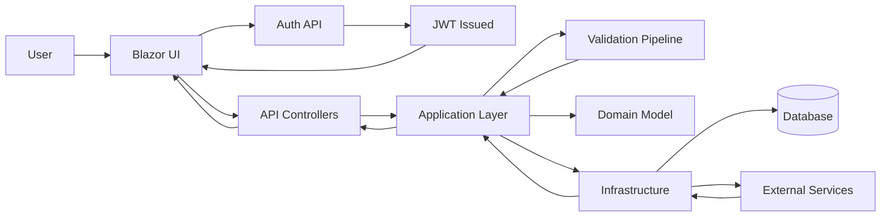
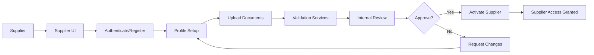

# MerinoOne Supplier Portal

MerinoOne Supplier Portal is a .NET-based supplier portal with a Clean Architecture and CQRS structure. It provides an API backend and a Blazor UI to manage supplier-related workflows.

## Key Functions

- Authentication and authorization for internal users and suppliers.
- Supplier master data and profile management.
- Messaging and communication between suppliers and the enterprise.
- Integration seams for ERP and validation services.
- ERP/Infor integration management: endpoint configuration and endpoint-wise table sharing.
- Email outbox, email templates, and document upload workflows.

## Features

- Clean Architecture layering (API, Application, Domain, Infrastructure).
- CQRS with MediatR command and query separation.
- Blazor web UI for supplier and internal users.
- Policy-based authorization and JWT bearer authentication.
- Validation and error handling pipeline.
- Integration abstraction with mock implementations for development.
- Tenant-scoped integration management with `Integration.Read` / `Integration.Manage` policies.
- Logging and diagnostics for API requests.

## Project Structure

- API host for REST endpoints.
- Application layer with commands, queries, and validation.
- Domain layer for entities and business rules.
- Infrastructure layer for persistence and integrations.
- Blazor UI for user-facing pages.
- Aspire app host for orchestration.

## Integration Management

Tenant-scoped admin features under `api/integration`. Reads require the `Integration.Read` policy; writes require `Integration.Manage`. All operations are scoped to the caller's tenant.

### Endpoint-wise table sharing (Share Groups)

Companies in a share group read/write a single shared master dataset per endpoint (e.g. Payment Term, Delivery Term), stored under a designated source company. Companies not in a group keep their own per-company master data.

- `GET    api/integration/share-groups` — list groups (optional `endpoint` filter), members resolved to company code + name.
- `POST   api/integration/share-groups` — create a group (endpoint + source company + initial members).
- `PUT    api/integration/share-groups/{id}` — update display name + enabled flag (endpoint/source/members not editable here).
- `POST   api/integration/share-groups/{id}/members` — add a member (restores a soft-deleted membership rather than duplicating).
- `DELETE api/integration/share-groups/{id}/members/{tenantEntityId}` — soft-delete a member (idempotent).
- `DELETE api/integration/share-groups/{id}` — soft-delete a group and its members.

Rules: a company can belong to only one group per endpoint (409 on conflict); a group is unique per (endpoint, source). Changes are not retroactive — already-received master rows keep their original source company. Blazor page: `/integrations/share-groups`.

### Other integration features

- Infor endpoints management with CRUD operations.
- Email outbox and email templates management.
- Document upload workflows.

## Functional Flow (Entire App)

## Functional Flow (Supplier Onboarding)

## Notes

- Environment-specific configuration is kept in the standard .NET appsettings files.
- Integration services are designed for swap-in real providers later.
